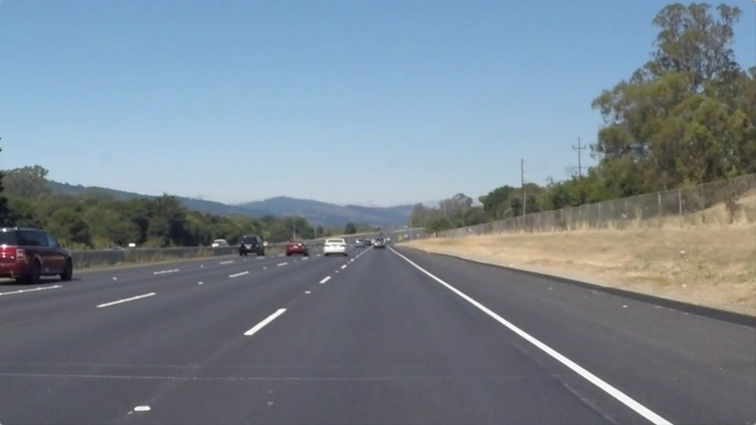
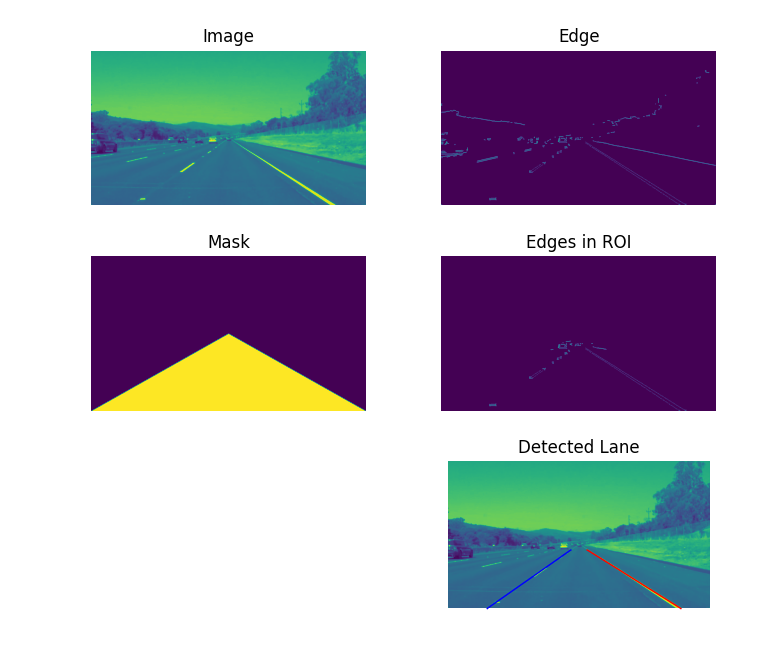
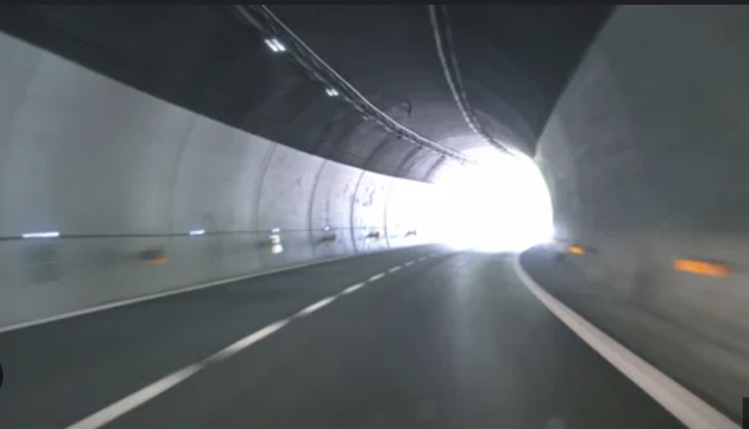
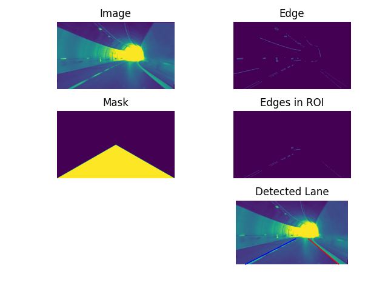

### Lane Detection

To implement a simple lane detection using Canny edge detector and Hough transform.

The algorithm can broken down into the following steps:

1. Detect edges using the Canny edge detector.
2. Extract the edges in the region of interest(ROI)
3. Run Hough transform to detect lanes.

### 1 .Library Required:

```bash
pip install scikit-image
pip install numpy
pip install matplotlib
```

### 2 . How to run program

2.1 update image path if needed

```python
#Change the image path to test on a different image
imagepath = 'road.jpg'
```

2.2 Run the **_main.py_** with command:

```bash
# To start
python3 main.py
```

2.3 It will take a while

```python
1/5.Lane Detection Loading Image...
-Image Path: road.jpg
2/5.Perfrom Canny Edge detection...
3/5.Perform Hough Transform...
4/5.Plotting Detected Lane...
5/5.Showing Detected Lane...
```

2.4 Result:

<table>
    <tr>
        <th>Input</th>
        <th>Result</th>
    </tr>
    <tr>
        <td>
            
        </td>
        <td>
            
        </td>
    </tr>
    <tr>
        <td>
            
        </td>
        <td>
            
        </td>
    </tr>
</table>
